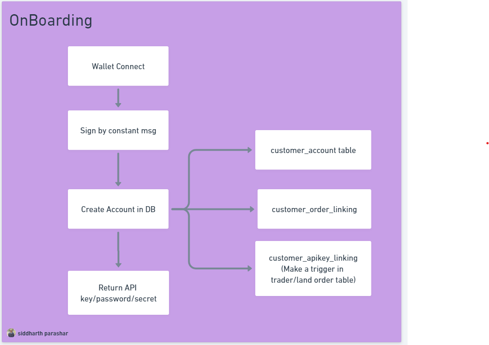

# Relayer Private API

## Registration API

    - onboarding api (public)
    - retrive api (request should be verified by signature) (public)

## Trader Order

    - get unrealized PnL by order id/public key
    - get unrealized PnL all
    - get all open orders
    - get order history by id(order id)
    - get order history pagination (client id)
    - customer trade volume
    - get funding payment
    - get last order detail

## Lendorder

    - order detail
    - client poolshare value
    - apy

# Registration API

### onboarding api (public)

Client need to send a signed msg from wallet to register their public key.
Signature should be verified and in reponse client will get the relayer-api-secret and relayer-api-key (for HMAC refer: [Link1](https://www.okta.com/identity-101/hmac/#:~:text=Hash%2Dbased%20message%20authentication%20code,use%20signatures%20and%20asymmetric%20cryptography.), [Link2](https://www.binance.com/en-BH/support/faq/how-to-create-api-360002502072), [Link3](https://www.binance.com/en/support/faq/how-to-create-api-keys-on-binance-360002502072) [Link4](https://docs.rs/hmac/latest/hmac/) )

<!--  -->

As image above api should create unique customer id and link the public key to that customer id.
now whenever customer place order using the same api key, database should maintain customerid <-> public key <-> orderid linking.
customer can use different account (different public key) to place order. api key will be a _unified key_ which will track/link the different public key to customer id.

Note: We can you either ed25519 order hashed client signature to generate unique relayer-api-key and relayer-api-secret.

### Retrieve Api Key (regenerate API key)

In case of client lose the relayer-api-key/ relayer-api-secret.
client can regenerate the relayer-api-key and relayer-api-secret from any of their public key signature (we need to look for the order id from that public key and then search the linked customer id). In this case , old api key will be inactive and new key will be responded to client.

# Authentication

Here we provide a simple example that shows you how to send a valid order to Relayer
Requests sent to the Private endpoints will require an order signature.

Client need to add following information into Request Header while calling any private api

| Header Name     | Description                                                                                           |
| --------------- | ----------------------------------------------------------------------------------------------------- |
| relayer-api-key | api key received from onboarding api                                                                  |
| signature       | the request signature can be generate from request parameters and signed with your relayer-api-secret |
| datetime        | unix formated datetime                                                                                |

Note: signature should be created using HMAC SHA256 method, refer [HMAC-Rust](https://docs.rs/hmac/latest/hmac/)

# Trader Order

### get unrealized PnL by order id/public key

Input: PnL can be retrive from both orderID or Public Key

Response: Pnl (float), datetime, current btc price, orderid

### get unrealized PnL all

In PnL all,api need to return PnL of all open orders linked to _unified key_

Response:Array of [ Pnl (float), datetime, current btc price, orderid ]

### get all open trader orders

In all open orders api, api need to return all open orders details linked to _unified key_

Response:Array of [TraderOrder]

### get order history by id(order id)

Input: orderID (Uuid)

Response: [TraderOrder]

### get last order detail

Input: Public Key

Response: [TraderOrder]

### get order history pagination

Client can get order history of all open/close trader orders with time range (from and to datetime) with pagination amx limit of 10(may update in future) order per page. Providing _unified key_

Response:Array of [TraderOrder]

# Lendorder

### order detail

Input: orderID (Uuid)

Response: [LendOrder]

### client poolshare value

Input: orderID (Uuid)

Response : orderID, Poolshare f64, Datetime

### apy

need to discuss further.
